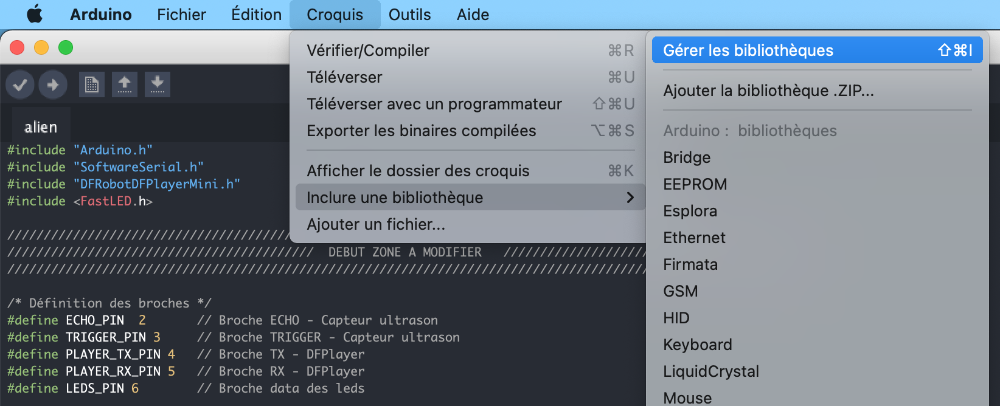
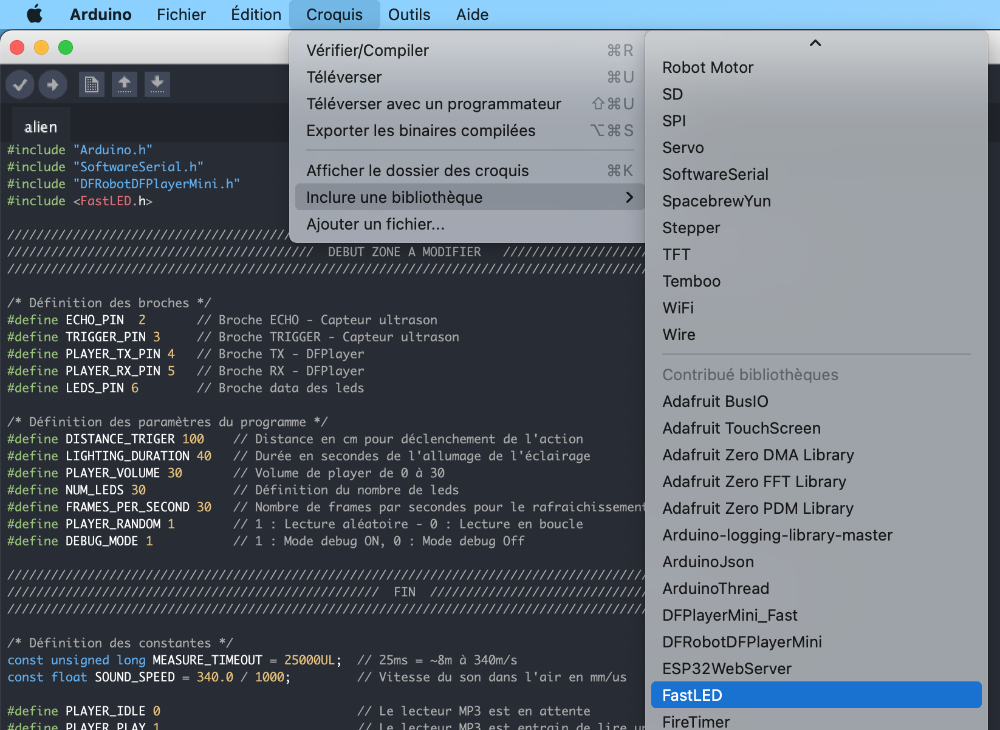

# Ajouter une bibliothèque à l'IDE Arduino

Nous allons voir comment installer la bibliothèque FastLed ci dessous, la manipulation est exactement la même pour toute autre bibliothèque.

Pour installer une nouvelle bibliothèque, utilisez le **Gestionnaire de bibliothèques** (disponible depuis la version 1.6.2 de l'IDE). Ouvrez l'IDE et cliquez sur le menu **Croquis** et puis **Inclure une bibliothèque > Gérer les bibliothèques**.

Le gestionnaire de bibliothèque s'ouvrira et vous trouverez une liste de bibliothèques déjà installées ou prêtes à être installées. Pour installer FastLED, recherchez "FastLED", faites défiler la liste pour le trouver et **cliquez dessus**.

Enfin, cliquez sur **installer** et attendez que l'IDE installe FastLED. Le téléchargement peut prendre du temps en fonction de la vitesse de votre connexion. Une fois terminé, une balise Installed devrait apparaître à côté de la bibliothèque FastLED. Vous pouvez **fermer** le gestionnaire de bibliothèque.

Vous devriez maintenant voir la bibliothèque dans le menu **Inclure une bibliothèque**.

