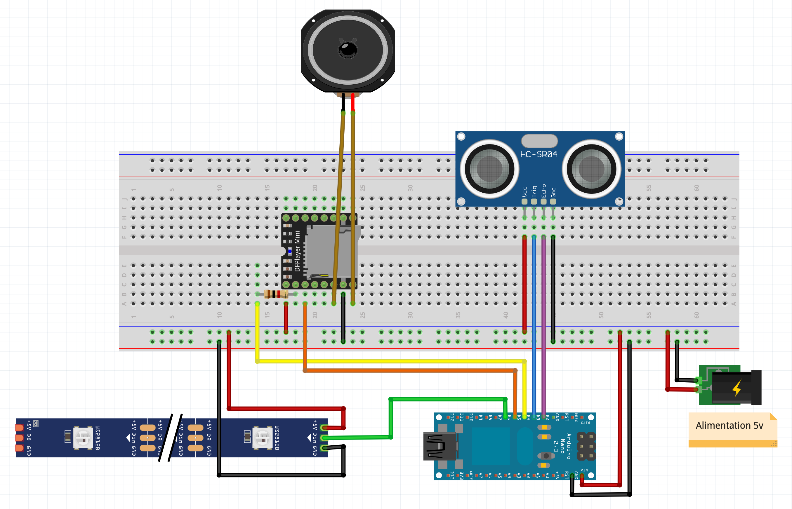

# Son et lumière (effet feux)

Ce montage permet de déclencher la lecture d'un fichier MP3 et l'allumage d'un bandeau de leds lorsque l'on détecte la présence d'une personne ou d'un objet devant le capteur. Tant que le relai est allumée et que la détection est positive, des MP3 sont lus en boucle.

## Liste du matériel

- Arduino (Uno, Nano, Mega...)
- Capteur à ultrason HC-SR04
- DFPlayer Mini MP3 Player
- Bandeau de leds avec contrôleur WS2812B
- Alimentation 5v
- Enceinte
- Résistance (1 KOhms)
- Carte SD

## Montage électronique

Les GPIO utilisés sont les suivants (vous êtes libre d'utiliser d'autres GPIO, il faudra juste définir ceux-ci dans le programme) :

- Capteur ultrason : 
	- GPIO 2 de l'arduino avec PIN ECHO du capteur
	- GPIO 3 de l'arduino au PIN TRIG du capteur
- Player MP3 :
	- GPIO 4 de l'arduino au PIN TX du player 
	- GPIO 5 de l'arduino au PIN RX du player
- Bandeau de leds :
	- GPIO 6 de l'arduino au PIN DATA du bandeau de leds

Si le bandeau de leds n'est pas alimenté en 5v comme l'arduino, il faut lui adjoindre une alimentation dédié. **Attention, tous les éléments du montage devront absolument partager la même masse.**

## Croquis

Pour utiliser le croquis, il est nécessaire d'installer les bibliothèques FastLed et DFRobotDFPlayerMini dans l'IDE Arduino. Vous pouvez suivre le tutorial suivant pour [installer une nouvelle bibliothèque](https://github.com/arnaultraes/Arduino/tree/main/Ajouter%20bibliotheque).

Liste des variables éditable dans le croquis et à adapter à votre configuration :

Variable      | Description
------------- | -------------
DISTANCE\_TRIGER  | Distance en cm a partir de laquelle le programme va considérer qu'un objet/personne est devant lui et donc déclencher la lumière et le son.
LIGHTING\_DURATION  | Durée minimale en secondes d'allumage des lumières. Durant cette durée tant qu'il y a un objet ou une personne devant le capteur à ultrason, des musiques vont se lancer les une après les autres.
PLAYER\_RANDOM  | Si il est égal à 1, les fichiers audio seront joué aléatoirement. Si il est égal à 0, les fichiers audio seront joués les uns après les autres avant de reboucler arriver à la fin.
PLAYER\_VOLUME  | Volume de l'enceinte entre 0 (son au minimun) et 30 (son au maximun).
NUM_LEDS  | Nombre de leds du bandeau.
FRAMES\_PER\_SECOND  | Le nombre de frames par secondes pour le rafraichissement du bandeau de leds lors de l'affichage de l'effet flamme.
DEBUG\_MODE  | Pour afficher un maximun d'information dans le moniteur série de l'arduino, mettre la valeur à 1, 0 sinon.

Une fois les LIGHTING\_DURATION secondes écoulés, le programme terminera la lecture de la bande son en cours et éteindra les lumières à ce moment là. Pour relancer l'allumage des leds et la lecture des sons, il faut que l'objet/personne s'éloigne du capteur à ultrasons (DISTANCE\_TRIGER cm) et rerentre dans la zone.